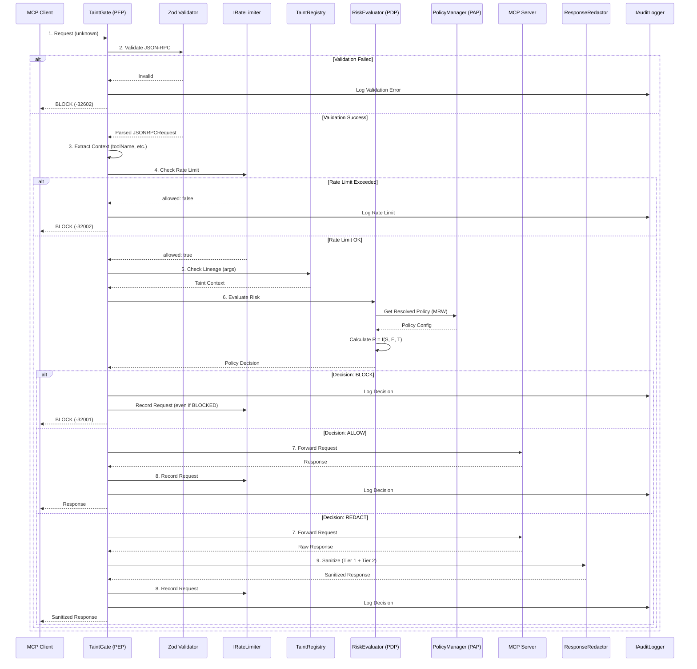
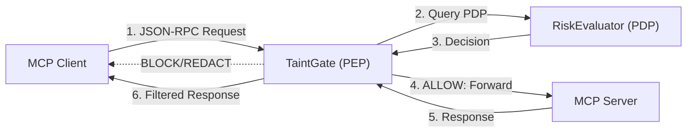
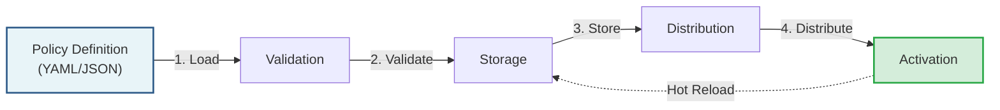
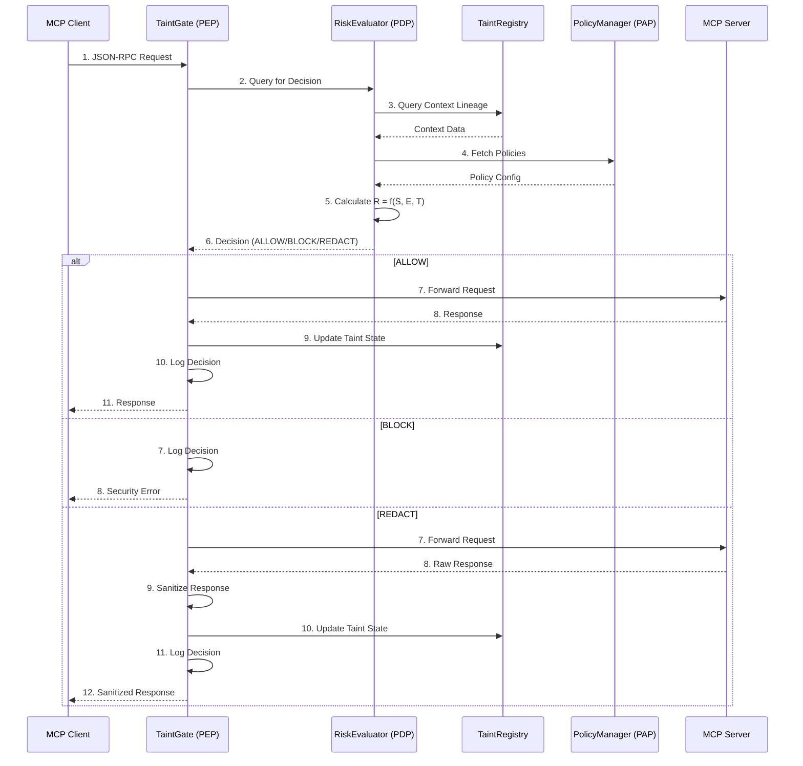
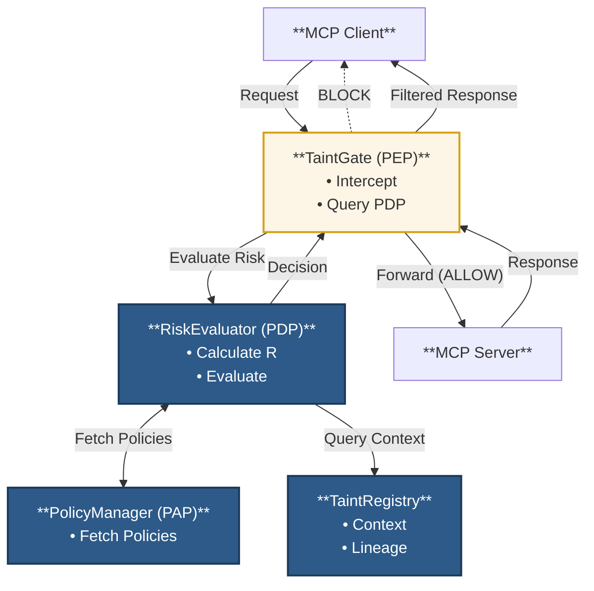
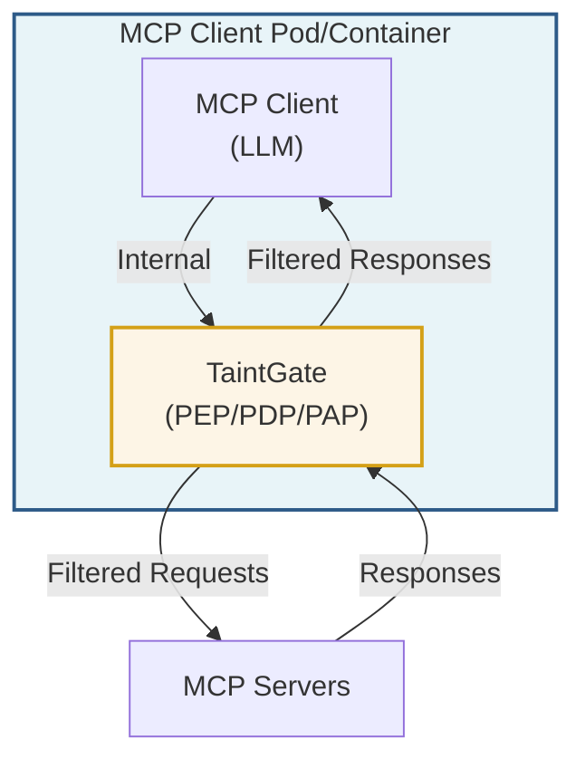
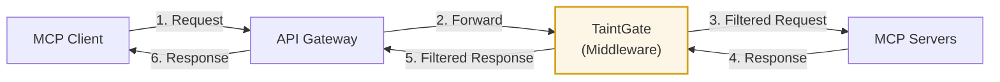
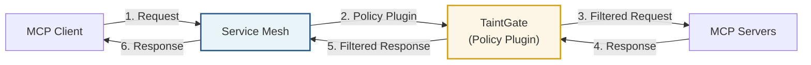

# TaintGate Architecture

## Overview

TaintGate implements a **three-layer security architecture** based on the XACML (eXtensible Access Control Markup Language) pattern, adapted for the Model Context Protocol. This architecture separates concerns into Policy Enforcement, Policy Decision, and Policy Administration layers, ensuring deterministic, auditable, and scalable security governance.

### Execution Flow

Every request follows this **canonical fail-closed sequence**:



**Canonical Sequence (Fail-Closed)**:
1. **Validation (Zod)**: Transform unknown → JSONRPCRequest (Fail? → BLOCK)
2. **Context Extraction**: Extract toolName from params.name if method is callTool
3. **Rate Limiting (Check)**: IRateLimiter.checkLimit() (Fail? → BLOCK)
4. **Governance**: TaintRegistry.checkLineage() → RiskEvaluator.evaluate() → PolicyManager.getResolvedPolicy()
5. **Enforcement**: If BLOCK → return error; If ALLOW/REDACT → forward to server
6. **Rate Limiting (Record)**: IRateLimiter.recordRequest() (even if BLOCKED)
7. **Sanitization**: If REDACT → IResponseRedactor.redact()

See [ARCHITECTURE_DECISIONS.md](./ARCHITECTURE_DECISIONS.md) for detailed decision rationale.

## Architecture Layers

### Layer 1: Policy Enforcement Point (PEP) - TaintGate

The **Policy Enforcement Point (PEP)** is the entry point and enforcement layer of TaintGate. It acts as a mandatory proxy that intercepts all JSON-RPC communication between MCP Clients and MCP Servers.

#### Responsibilities

1. **Request Interception**
   - Intercepts all JSON-RPC requests at the transport layer
   - Supports protocol methods: `callTool`, `listTools`, `initialize`, `notifications`
   - Operates as a mandatory proxy (sidecar pattern) - cannot be bypassed

2. **Policy Decision Query**
   - Forwards request context to the Policy Decision Point (PDP) for evaluation
   - Includes: tool name, parameters, session ID, tenant ID, metadata hints
   - Implements timeout handling (default: 2 seconds)

3. **Decision Enforcement**
   - **ALLOW**: Forwards request to MCP Server unchanged (R < 0.3)
   - **BLOCK**: Rejects request with security error (R ≥ 0.7)
   - **REDACT**: Forwards request, sanitizes response via ResponseRedactor (0.3 ≤ R < 0.7)

4. **Fail-Closed Behavior**
   - On PDP timeout → **BLOCK**
   - On TaintRegistry unavailability → **BLOCK**
   - On evaluation exception → **BLOCK**
   - Ensures security by default, never fails open

5. **Performance Optimization**
   - Stream-thru processing for very low-risk requests (R < 0.1)
   - Minimizes buffer overhead for trusted operations
   - Zero-copy forwarding where possible (platform-dependent)

6. **Audit Logging**
   - Logs all decisions with full context
   - Includes: timestamp, session ID, tenant ID, tool, risk score, decision, latency

#### Interface Contract

```typescript
interface TaintGate {
  // Intercept and evaluate request
  evaluateRequest(request: JSONRPCRequest, context: RequestContext): Promise<PolicyDecision>;
  
  // Enforce decision
  enforceDecision(decision: PolicyDecision, request: JSONRPCRequest): Promise<JSONRPCResponse>;
  
  // Fail-closed error handling
  handleFailure(error: Error, context: RequestContext): PolicyDecision;
}
```

#### Request Flow



---

### Layer 2: Policy Decision Point (PDP) - RiskEvaluator

The **Policy Decision Point (PDP)** is the core decision engine that evaluates requests against security policies and calculates risk scores. It implements a deterministic, mathematically-valid risk assessment algorithm.

#### Responsibilities

1. **Risk Score Calculation**
   - Implements normalized risk formula: `R = clamp((W_s × S + W_e × E) × (1 - T), 0, 1)`
   - Ensures mathematical validity (no division by zero, proper normalization)
   - Returns risk score in range [0, 1]

2. **Metadata Evaluation**
   - Extracts and evaluates MCP security hints:
     - `trustedHint` → Trust (T) calculation
     - `sensitiveHint` → Sensitivity (S) calculation
     - `openWorldHint` → Exposure (E) calculation
     - `secretHint` → Additional risk factor
   - Implements fail-closed defaults for missing hints

3. **Context-Aware Risk Assessment**
   - Queries TaintRegistry for context lineage
   - Considers taint propagation in risk calculation
   - Evaluates tool output history for trust scoring

4. **Policy Application**
   - Fetches policies from PolicyManager (PAP)
   - Applies per-tenant policy configurations
   - Enforces risk thresholds (configurable per tenant)

5. **Deterministic Guarantee**
   - Same inputs (S, E, T) → Same output (R)
   - Ensures auditability and reproducibility
   - Historical data influences Trust (T) as input, but calculation is deterministic

#### Risk Formula

```
R = clamp((W_s × S + W_e × E) × (1 - T), 0, 1)
```

**Variables:**
- **S (Sensitivity)**: `{0, 0.5, 1.0}` - Data classification level
  - `0` = Public data
  - `0.5` = Internal data
  - `1.0` = Confidential/Restricted data
- **E (Exposure)**: `{0, 1}` - Egress risk
  - `0` = Closed-world (internal destination)
  - `1` = Open-world (external/untrusted destination)
- **T (Trust)**: `[0, 1]` - Tool trustworthiness
  - `0` = Unknown/untrusted tool
  - `1` = Verified/trusted tool
- **W_s, W_e**: Configurable weights (default: W_s = 0.6, W_e = 0.4)

**Edge Cases:**
- Missing `trustedHint` → T = 0 (fail-closed)
- Missing `sensitiveHint` → S = 1.0 (maximum sensitivity)
- Missing `openWorldHint` → E = 1 (maximum egress risk)
- Perfect trust (T = 1) → R = 0 (zero risk)

#### Decision Logic

| Risk Score (R) | Decision | Rationale |
|---------------|----------|-----------|
| 0.0 ≤ R < 0.3 | **ALLOW** | Low risk: Trusted tool, safe data, closed-world |
| 0.3 ≤ R < 0.7 | **REDACT** | Moderate risk: Sanitize sensitive fields |
| 0.7 ≤ R ≤ 1.0 | **BLOCK** | High risk: Untrusted tool, sensitive data, open-world |

#### Interface Contract

```typescript
interface RiskEvaluator {
  // Calculate risk score
  calculateRisk(context: EvaluationContext): Promise<RiskScore>;
  
  // Make policy decision
  evaluatePolicy(request: ToolRequest, riskScore: RiskScore): Promise<PolicyDecision>;
  
  // Get evaluation context
  buildContext(request: ToolRequest, sessionId: string): Promise<EvaluationContext>;
}
```

#### Evaluation Flow

```
Request Context → Extract Metadata → Calculate (S, E, T) → Compute R → Apply Thresholds → Decision
                      ↓
                  [Query TaintRegistry]
                      ↓
                  [Fetch Policies from PAP]
```

---

### Layer 3: Policy Administration Point (PAP) - PolicyManager

The **Policy Administration Point (PAP)** manages security policies, configurations, and policy lifecycle. It provides the administrative interface for defining, updating, and distributing security policies.

#### Responsibilities

1. **Policy Loading**
   - Loads policies from YAML/JSON configuration files
   - Supports hierarchical policy structure (global → tenant → tool)
   - Validates policy syntax and semantics

2. **Policy Storage**
   - Maintains policy repository (file-based or database)
   - Supports versioning and rollback
   - Tracks policy change history

3. **Per-Tenant Configuration**
   - Manages tenant-specific policy overrides
   - Supports multi-tenant isolation
   - Enables custom risk thresholds per tenant

4. **Dynamic Policy Updates**
   - Hot-reload capability (no service restart required)
   - Atomic policy updates (no partial state)
   - Policy validation before activation

5. **Policy Distribution**
   - Distributes policies to PDP instances
   - Ensures consistency across distributed deployments
   - Supports policy caching for performance

#### Policy Structure

```yaml
# Global Policy
global:
  riskThresholds:
    allow: 0.3
    block: 0.7
  weights:
    sensitivity: 0.6
    exposure: 0.4
  failClosed: true
  defaultTrust: 0.0

# Tenant-Specific Overrides
tenants:
  financial-services:
    riskThresholds:
      allow: 0.2
      block: 0.5
    weights:
      sensitivity: 0.7
      exposure: 0.3
  
  development:
    riskThresholds:
      allow: 0.5
      block: 0.9

# Tool-Specific Rules
tools:
  allowlist:
    - trusted-tool-1
    - trusted-tool-2
  denylist:
    - untrusted-tool-1
  customRules:
    sensitive-tool:
      requireHITL: true
      threshold: 0.6
```

#### Interface Contract

```typescript
interface PolicyManager {
  // Load policies
  loadPolicies(configPath: string): Promise<PolicySet>;
  
  // Get policy for tenant
  getPolicy(tenantId: string): Promise<TenantPolicy>;
  
  // Hot-reload policies
  reloadPolicies(): Promise<void>;
  
  // Validate policy
  validatePolicy(policy: Policy): ValidationResult;
}
```

#### Policy Lifecycle



---

## Supporting Components

### TaintRegistry (State Manager)

While not part of the core XACML layers, the **TaintRegistry** provides critical state management for context-aware risk assessment.

#### Role in Architecture

- **Provides Context to PDP**: Supplies taint lineage information for risk calculation
- **Session State Management**: Maintains stateful session data (stateless per request)
- **Multi-Tenant Isolation**: Ensures tenant-scoped state separation

#### Integration Points

- **PDP → TaintRegistry**: Queries context lineage during risk evaluation
- **PEP → TaintRegistry**: Updates taint state after tool execution
- **Stateless Design**: Each request can query any TaintRegistry instance (distributed cache)

### ResponseRedactor (Sanitization Engine)

The **ResponseRedactor** implements the REDACT decision enforcement.

#### Role in Architecture

- **PEP Integration**: Called by TaintGate when decision is REDACT
- **Two-Tier Sanitization**: Schema-based + Pattern-based scrubbing
- **Deterministic Output**: Same input → Same sanitized output

#### Integration Points

- **PEP → ResponseRedactor**: Invoked for REDACT decisions
- **Response Processing**: Sanitizes MCP Server responses before returning to client

---

## Layer Interactions

### Request Flow (Complete)



### Decision Flow Diagram



---

## Architecture Principles

### 1. Separation of Concerns
- **PEP**: Enforcement only, no policy logic
- **PDP**: Decision logic only, no enforcement
- **PAP**: Policy management only, no runtime decisions

### 2. Fail-Closed Security
- All failures default to BLOCK
- Missing metadata = maximum risk
- Timeout = BLOCK
- Exception = BLOCK

### 3. Deterministic Decisions
- Same inputs → Same outputs
- Reproducible for auditing
- No non-deterministic randomness

### 4. Horizontal Scalability
- Stateless request processing
- Distributed state (TaintRegistry)
- Policy distribution (PAP → PDP)

### 5. Auditability
- All decisions logged with full context
- Risk score calculation breakdown
- Policy version tracking

---

## Deployment Architecture

### Sidecar Pattern (Recommended)



### API Gateway Pattern



### Service Mesh Pattern



---

## Performance Characteristics

### PEP (TaintGate)
- **Latency**: < 1ms overhead (excluding PDP evaluation)
- **Throughput**: 10,000+ requests/second per instance
- **Stream-thru**: Zero-copy for R < 0.1

### PDP (RiskEvaluator)
- **Evaluation Time**: < 2ms (p95) for standard requests
- **Cache Hit Rate**: > 90% (policy and context caching)
- **Concurrent Evaluations**: 1000+ per instance

### PAP (PolicyManager)
- **Policy Load Time**: < 100ms for 1000 policies
- **Hot Reload**: < 50ms for atomic updates
- **Distribution**: < 200ms across 10 instances

---

## Security Considerations

### Threat Mitigation

1. **Bypass Attempts**: Mandatory proxy ensures all traffic flows through PEP
2. **Policy Tampering**: PolicyManager validates and signs policies
3. **State Poisoning**: TaintRegistry uses tenant isolation and validation
4. **DoS Attacks**: Rate limiting and timeout enforcement
5. **Information Leakage**: ResponseRedactor ensures no sensitive data leaks

### Compliance

- **Audit Trail**: All decisions logged with full context
- **Compliance Reports**: Risk score distributions, policy violations
- **Data Retention**: Configurable log retention per compliance requirements

---

## References

- [XACML Architecture](https://docs.oasis-open.org/xacml/3.0/xacml-3.0-core-spec-os-en.html)
- [Policy Enforcement Point Pattern](https://en.wikipedia.org/wiki/XACML)
- [Model Context Protocol Specification](https://modelcontextprotocol.io/)

---

**Last Updated**: 2024-2025  
**Version**: 1.0

