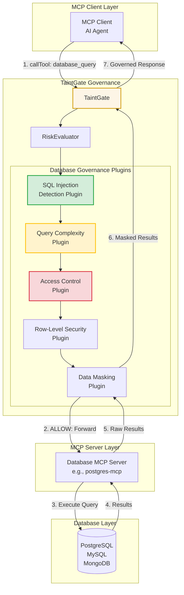

# Database Governance Plugins for TaintGate

## Overview

TaintGate can govern database access through **database-specific plugins** that intercept, analyze, and control database operations at multiple levels:

1. **MCP Protocol Level** - When database MCP servers are used
2. **SQL Query Level** - SQL injection detection, query complexity analysis
3. **Operation Level** - READ vs WRITE vs DELETE permissions
4. **Data Level** - Row-level security, column masking, data classification

---

## Architecture: Database Governance Layers



---

## Database Governance Plugin Categories

### 1. SQL Security Plugins

#### A. SQL Injection Detection Plugin

**Purpose**: Detect and block SQL injection attacks

```typescript
// plugins/database/sql-injection-detection.ts
import { IGovernancePlugin, EvaluationContext, PluginDecision } from '@taintgate/plugins';

export class SQLInjectionDetectionPlugin implements IGovernancePlugin {
  readonly id = 'sql-injection-detection';
  readonly version = '1.0.0';
  readonly priority = 5; // Very high priority (evaluate first)
  
  private readonly sqlInjectionPatterns = [
    /(\b(SELECT|INSERT|UPDATE|DELETE|DROP|CREATE|ALTER|EXEC|EXECUTE)\b.*\b(UNION|OR|AND)\b)/i,
    /('|(\\')|(;)|(\\;)|(\|)|(\||)|(\*)|(%)|(\+)|(-)|(\/)|(\\)|(\()|(\))|(\[)|(\])|(\{)|(\}))/i,
    /(\b(OR|AND)\s+\d+\s*=\s*\d+)/i,
    /(\b(OR|AND)\s+['"]\w+['"]\s*=\s*['"]\w+['"])/i,
    /(\b(UNION|SELECT)\s+.*\s+FROM)/i,
  ];
  
  async evaluate(context: EvaluationContext): Promise<PluginDecision> {
    // Extract SQL query from tool parameters
    const sqlQuery = this.extractSQLQuery(context);
    
    if (!sqlQuery) {
      return { action: 'ALLOW' }; // Not a database operation
    }
    
    // Check for SQL injection patterns
    for (const pattern of this.sqlInjectionPatterns) {
      if (pattern.test(sqlQuery)) {
        await this.logSecurityIncident(context, 'SQL injection attempt detected');
        return {
          action: 'BLOCK',
          reason: 'SQL injection attempt detected',
          metadata: {
            detectedPattern: pattern.toString(),
            query: this.sanitizeForLogging(sqlQuery),
            severity: 'CRITICAL',
          },
        };
      }
    }
    
    // Check for suspicious patterns
    const suspiciousPatterns = [
      /;\s*(DROP|DELETE|TRUNCATE)/i,
      /--\s*$/, // SQL comment injection
      /\/\*.*\*\//, // Multi-line comment injection
    ];
    
    for (const pattern of suspiciousPatterns) {
      if (pattern.test(sqlQuery)) {
        return {
          action: 'MODIFY',
          riskModifier: 1.5, // Escalate risk
          reason: 'Suspicious SQL pattern detected',
          metadata: { pattern: pattern.toString() },
        };
      }
    }
    
    return { action: 'ALLOW' };
  }
  
  private extractSQLQuery(context: EvaluationContext): string | null {
    // Extract SQL from tool parameters
    if (context.toolName?.includes('database') || context.toolName?.includes('sql')) {
      const params = context.toolParameters || {};
      return params.query as string || params.sql as string || null;
    }
    return null;
  }
  
  private sanitizeForLogging(query: string): string {
    // Remove sensitive data before logging
    return query.substring(0, 200) + (query.length > 200 ? '...' : '');
  }
  
  async healthCheck(): Promise<boolean> {
    return true;
  }
}
```

---

#### B. Query Complexity Analysis Plugin

**Purpose**: Limit query complexity to prevent DoS and resource exhaustion

```typescript
// plugins/database/query-complexity.ts
export class QueryComplexityPlugin implements IGovernancePlugin {
  readonly id = 'query-complexity';
  readonly version = '1.0.0';
  readonly priority = 15;
  
  private readonly complexityLimits = {
    maxJoins: 5,
    maxSubqueries: 3,
    maxUnionOperations: 2,
    maxQueryLength: 10000, // characters
    maxTableReferences: 10,
  };
  
  async evaluate(context: EvaluationContext): Promise<PluginDecision> {
    const sqlQuery = this.extractSQLQuery(context);
    if (!sqlQuery) {
      return { action: 'ALLOW' };
    }
    
    // Analyze query complexity
    const complexity = this.analyzeComplexity(sqlQuery);
    
    // Check limits
    if (complexity.joins > this.complexityLimits.maxJoins) {
      return {
        action: 'BLOCK',
        reason: `Query exceeds maximum join limit: ${complexity.joins} > ${this.complexityLimits.maxJoins}`,
        metadata: { complexity },
      };
    }
    
    if (complexity.subqueries > this.complexityLimits.maxSubqueries) {
      return {
        action: 'BLOCK',
        reason: `Query exceeds maximum subquery limit: ${complexity.subqueries} > ${this.complexityLimits.maxSubqueries}`,
        metadata: { complexity },
      };
    }
    
    if (sqlQuery.length > this.complexityLimits.maxQueryLength) {
      return {
        action: 'BLOCK',
        reason: `Query exceeds maximum length: ${sqlQuery.length} > ${this.complexityLimits.maxQueryLength}`,
      };
    }
    
    // Escalate risk for complex queries
    if (complexity.joins > 3 || complexity.subqueries > 1) {
      return {
        action: 'MODIFY',
        riskModifier: 1.2, // Increase risk by 20%
        reason: 'Complex query detected',
        metadata: { complexity },
      };
    }
    
    return { action: 'ALLOW' };
  }
  
  private analyzeComplexity(query: string): QueryComplexity {
    return {
      joins: (query.match(/\bJOIN\b/gi) || []).length,
      subqueries: (query.match(/\bSELECT\b.*\bFROM\b/gi) || []).length - 1, // Subtract main query
      unions: (query.match(/\bUNION\b/gi) || []).length,
      tableReferences: (query.match(/\bFROM\s+(\w+)/gi) || []).length,
    };
  }
  
  async healthCheck(): Promise<boolean> {
    return true;
  }
}

interface QueryComplexity {
  joins: number;
  subqueries: number;
  unions: number;
  tableReferences: number;
}
```

---

### 2. Access Control Plugins

#### A. Database Operation Control Plugin

**Purpose**: Control READ, WRITE, DELETE operations based on user permissions

```typescript
// plugins/database/operation-control.ts
export class DatabaseOperationControlPlugin implements IGovernancePlugin {
  readonly id = 'database-operation-control';
  readonly version = '1.0.0';
  readonly priority = 12;
  
  async evaluate(context: EvaluationContext): Promise<PluginDecision> {
    const sqlQuery = this.extractSQLQuery(context);
    if (!sqlQuery) {
      return { action: 'ALLOW' };
    }
    
    // Detect operation type
    const operation = this.detectOperation(sqlQuery);
    
    // Get user permissions
    const permissions = await this.getUserPermissions(context.userId, context.tenantId);
    
    // Check permissions
    switch (operation) {
      case 'SELECT':
        if (!permissions.canRead) {
          return {
            action: 'BLOCK',
            reason: 'User does not have READ permission',
            metadata: { operation, permissions },
          };
        }
        break;
        
      case 'INSERT':
      case 'UPDATE':
        if (!permissions.canWrite) {
          return {
            action: 'BLOCK',
            reason: 'User does not have WRITE permission',
            metadata: { operation, permissions },
          };
        }
        break;
        
      case 'DELETE':
      case 'DROP':
      case 'TRUNCATE':
        if (!permissions.canDelete) {
          return {
            action: 'BLOCK',
            reason: 'User does not have DELETE permission',
            metadata: { operation, permissions },
          };
        }
        // DELETE operations are high-risk
        return {
          action: 'MODIFY',
          riskModifier: 1.8, // Escalate risk significantly
          reason: 'DELETE operation detected',
          metadata: { operation },
        };
        
      case 'DDL': // CREATE, ALTER, DROP TABLE
        if (!permissions.canModifySchema) {
          return {
            action: 'BLOCK',
            reason: 'User does not have schema modification permission',
            metadata: { operation },
          };
        }
        // DDL operations are very high-risk
        return {
          action: 'MODIFY',
          riskModifier: 2.0, // Maximum risk escalation
          reason: 'DDL operation detected',
          metadata: { operation },
        };
    }
    
    return { action: 'ALLOW' };
  }
  
  private detectOperation(query: string): DatabaseOperation {
    const upperQuery = query.trim().toUpperCase();
    
    if (upperQuery.startsWith('SELECT')) return 'SELECT';
    if (upperQuery.startsWith('INSERT')) return 'INSERT';
    if (upperQuery.startsWith('UPDATE')) return 'UPDATE';
    if (upperQuery.startsWith('DELETE')) return 'DELETE';
    if (upperQuery.startsWith('DROP')) return 'DROP';
    if (upperQuery.startsWith('TRUNCATE')) return 'TRUNCATE';
    if (upperQuery.startsWith('CREATE') || upperQuery.startsWith('ALTER')) return 'DDL';
    
    return 'UNKNOWN';
  }
  
  private async getUserPermissions(
    userId: string,
    tenantId: string
  ): Promise<DatabasePermissions> {
    // Query permission store (database, cache, etc.)
    return {
      canRead: true,
      canWrite: false, // Example: read-only user
      canDelete: false,
      canModifySchema: false,
    };
  }
  
  async healthCheck(): Promise<boolean> {
    return await this.permissionStore.isHealthy();
  }
}

type DatabaseOperation = 'SELECT' | 'INSERT' | 'UPDATE' | 'DELETE' | 'DROP' | 'TRUNCATE' | 'DDL' | 'UNKNOWN';

interface DatabasePermissions {
  canRead: boolean;
  canWrite: boolean;
  canDelete: boolean;
  canModifySchema: boolean;
}
```

---

#### B. Table-Level Access Control Plugin

**Purpose**: Restrict access to specific tables based on policies

```typescript
// plugins/database/table-access-control.ts
export class TableAccessControlPlugin implements IGovernancePlugin {
  readonly id = 'table-access-control';
  readonly version = '1.0.0';
  readonly priority = 13;
  
  private readonly restrictedTables = [
    'users',
    'passwords',
    'credit_cards',
    'ssn',
    'medical_records',
  ];
  
  async evaluate(context: EvaluationContext): Promise<PluginDecision> {
    const sqlQuery = this.extractSQLQuery(context);
    if (!sqlQuery) {
      return { action: 'ALLOW' };
    }
    
    // Extract table names from query
    const tables = this.extractTableNames(sqlQuery);
    
    // Check for restricted tables
    for (const table of tables) {
      if (this.restrictedTables.includes(table.toLowerCase())) {
        // Check if user has explicit access
        const hasAccess = await this.checkTableAccess(
          context.userId,
          context.tenantId,
          table
        );
        
        if (!hasAccess) {
          return {
            action: 'BLOCK',
            reason: `Access denied to restricted table: ${table}`,
            metadata: { table, restrictedTables: this.restrictedTables },
          };
        }
      }
    }
    
    return { action: 'ALLOW' };
  }
  
  private extractTableNames(query: string): string[] {
    const tables: string[] = [];
    
    // Extract FROM clause tables
    const fromMatches = query.match(/\bFROM\s+(\w+)/gi);
    if (fromMatches) {
      fromMatches.forEach(match => {
        const table = match.replace(/\bFROM\s+/i, '').trim();
        tables.push(table);
      });
    }
    
    // Extract JOIN clause tables
    const joinMatches = query.match(/\bJOIN\s+(\w+)/gi);
    if (joinMatches) {
      joinMatches.forEach(match => {
        const table = match.replace(/\bJOIN\s+/i, '').trim();
        tables.push(table);
      });
    }
    
    return [...new Set(tables)]; // Remove duplicates
  }
  
  private async checkTableAccess(
    userId: string,
    tenantId: string,
    table: string
  ): Promise<boolean> {
    // Check access control list
    // This could query a database, cache, or policy store
    return false; // Default: no access
  }
  
  async healthCheck(): Promise<boolean> {
    return true;
  }
}
```

---

### 3. Row-Level Security (RLS) Plugin

**Purpose**: Implement row-level security based on user context

```typescript
// plugins/database/row-level-security.ts
export class RowLevelSecurityPlugin implements IGovernancePlugin {
  readonly id = 'row-level-security';
  readonly version = '1.0.0';
  readonly priority = 14;
  
  async evaluate(context: EvaluationContext): Promise<PluginDecision> {
    const sqlQuery = this.extractSQLQuery(context);
    if (!sqlQuery) {
      return { action: 'ALLOW' };
    }
    
    // Check if query needs RLS
    const tablesRequiringRLS = await this.getTablesRequiringRLS(context.tenantId);
    const queryTables = this.extractTableNames(sqlQuery);
    
    const needsRLS = queryTables.some(table => tablesRequiringRLS.includes(table));
    
    if (needsRLS) {
      // Check if query already has RLS predicates
      const hasRLSPredicate = this.checkRLSPredicate(sqlQuery, context.userId);
      
      if (!hasRLSPredicate) {
        // Query needs RLS but doesn't have it - modify query
        return {
          action: 'MODIFY',
          riskModifier: 1.3,
          reason: 'Query requires row-level security but missing predicates',
          metadata: {
            requiresRLS: true,
            tables: queryTables,
            userId: context.userId,
          },
        };
      }
    }
    
    return { action: 'ALLOW' };
  }
  
  private checkRLSPredicate(query: string, userId: string): boolean {
    // Check if query has user_id filter or similar RLS predicate
    const rlsPatterns = [
      new RegExp(`user_id\\s*=\\s*['"]?${userId}['"]?`, 'i'),
      new RegExp(`tenant_id\\s*=\\s*['"]?${context.tenantId}['"]?`, 'i'),
      /\bWHERE\s+.*\b(user_id|tenant_id|owner_id)\b/i,
    ];
    
    return rlsPatterns.some(pattern => pattern.test(query));
  }
  
  private async getTablesRequiringRLS(tenantId: string): Promise<string[]> {
    // Get list of tables that require RLS
    return ['user_data', 'tenant_data', 'sensitive_records'];
  }
  
  async healthCheck(): Promise<boolean> {
    return true;
  }
}
```

---

### 4. Data Masking Plugin

**Purpose**: Mask sensitive data in query results

```typescript
// plugins/database/data-masking.ts
export class DataMaskingPlugin implements IGovernancePlugin {
  readonly id = 'data-masking';
  readonly version = '1.0.0';
  readonly priority = 25; // Lower priority (applies to responses)
  
  private readonly sensitiveColumns = [
    'password',
    'ssn',
    'credit_card',
    'email',
    'phone',
    'address',
  ];
  
  async evaluate(context: EvaluationContext): Promise<PluginDecision> {
    const sqlQuery = this.extractSQLQuery(context);
    if (!sqlQuery) {
      return { action: 'ALLOW' };
    }
    
    // Check if query selects sensitive columns
    const selectedColumns = this.extractSelectedColumns(sqlQuery);
    const hasSensitiveColumns = selectedColumns.some(col => 
      this.sensitiveColumns.some(sensitive => 
        col.toLowerCase().includes(sensitive)
      )
    );
    
    if (hasSensitiveColumns) {
      // Mark for masking in response
      return {
        action: 'MODIFY',
        riskModifier: 1.2,
        reason: 'Query selects sensitive columns - will be masked in response',
        metadata: {
          requiresMasking: true,
          sensitiveColumns: selectedColumns.filter(col =>
            this.sensitiveColumns.some(s => col.toLowerCase().includes(s))
          ),
        },
      };
    }
    
    return { action: 'ALLOW' };
  }
  
  /**
   * Mask database response data
   * This is called by ResponseRedactor when decision is REDACT
   */
  async maskDatabaseResponse(
    response: any,
    metadata: Record<string, unknown>
  ): Promise<any> {
    if (!metadata.requiresMasking) {
      return response;
    }
    
    const sensitiveColumns = metadata.sensitiveColumns as string[];
    
    // Recursively mask sensitive columns in response
    return this.maskRecursive(response, sensitiveColumns);
  }
  
  private maskRecursive(obj: any, sensitiveColumns: string[]): any {
    if (Array.isArray(obj)) {
      return obj.map(item => this.maskRecursive(item, sensitiveColumns));
    }
    
    if (typeof obj === 'object' && obj !== null) {
      const masked: any = {};
      for (const [key, value] of Object.entries(obj)) {
        const isSensitive = sensitiveColumns.some(col =>
          key.toLowerCase().includes(col.toLowerCase())
        );
        
        if (isSensitive) {
          masked[key] = this.maskValue(value);
        } else {
          masked[key] = this.maskRecursive(value, sensitiveColumns);
        }
      }
      return masked;
    }
    
    return obj;
  }
  
  private maskValue(value: any): string {
    if (typeof value !== 'string') {
      value = String(value);
    }
    
    // Mask based on data type pattern
    if (/^\d{3}-\d{2}-\d{4}$/.test(value)) {
      return '***-**-****'; // SSN
    }
    if (/^\d{4}\s?\d{4}\s?\d{4}\s?\d{4}$/.test(value)) {
      return '****-****-****-****'; // Credit card
    }
    if (/^[\w.-]+@[\w.-]+\.\w+$/.test(value)) {
      return '***@***.***'; // Email
    }
    
    // Default: mask all but last 4 characters
    return value.length > 4 
      ? '*'.repeat(value.length - 4) + value.slice(-4)
      : '****';
  }
  
  private extractSelectedColumns(query: string): string[] {
    // Extract column names from SELECT clause
    const selectMatch = query.match(/SELECT\s+(.*?)\s+FROM/i);
    if (!selectMatch) {
      return [];
    }
    
    const columns = selectMatch[1]
      .split(',')
      .map(col => col.trim().split(/\s+/)[0]) // Get column name (before AS alias)
      .filter(col => col !== '*');
    
    return columns;
  }
  
  async healthCheck(): Promise<boolean> {
    return true;
  }
}
```

---

### 5. Query Result Limiting Plugin

**Purpose**: Limit result set size to prevent data exfiltration

```typescript
// plugins/database/result-limiting.ts
export class QueryResultLimitingPlugin implements IGovernancePlugin {
  readonly id = 'query-result-limiting';
  readonly version = '1.0.0';
  readonly priority = 16;
  
  private readonly maxRows = 1000; // Maximum rows per query
  private readonly maxDataSize = 10 * 1024 * 1024; // 10MB maximum response size
  
  async evaluate(context: EvaluationContext): Promise<PluginDecision> {
    const sqlQuery = this.extractSQLQuery(context);
    if (!sqlQuery) {
      return { action: 'ALLOW' };
    }
    
    // Check if query has LIMIT clause
    const hasLimit = /\bLIMIT\s+\d+/i.test(sqlQuery);
    
    if (!hasLimit) {
      // Query doesn't have LIMIT - add it
      return {
        action: 'MODIFY',
        riskModifier: 1.1,
        reason: 'Query missing LIMIT clause - will be enforced',
        metadata: {
          requiresLimit: true,
          maxRows: this.maxRows,
        },
      };
    }
    
    // Check if LIMIT exceeds maximum
    const limitMatch = sqlQuery.match(/\bLIMIT\s+(\d+)/i);
    if (limitMatch) {
      const limit = parseInt(limitMatch[1], 10);
      if (limit > this.maxRows) {
        return {
          action: 'BLOCK',
          reason: `Query LIMIT (${limit}) exceeds maximum (${this.maxRows})`,
          metadata: { limit, maxRows: this.maxRows },
        };
      }
    }
    
    return { action: 'ALLOW' };
  }
  
  /**
   * Enforce result limits on response
   */
  async enforceResultLimits(
    response: any,
    metadata: Record<string, unknown>
  ): Promise<any> {
    if (Array.isArray(response.result)) {
      const rows = response.result;
      
      // Limit rows
      if (rows.length > this.maxRows) {
        response.result = rows.slice(0, this.maxRows);
        response.metadata = {
          ...response.metadata,
          totalRows: rows.length,
          returnedRows: this.maxRows,
          truncated: true,
        };
      }
      
      // Check data size
      const dataSize = JSON.stringify(response.result).length;
      if (dataSize > this.maxDataSize) {
        // Truncate to fit size limit
        response.result = this.truncateToSize(response.result, this.maxDataSize);
        response.metadata = {
          ...response.metadata,
          originalSize: dataSize,
          truncated: true,
        };
      }
    }
    
    return response;
  }
  
  private truncateToSize(data: any[], maxSize: number): any[] {
    let currentSize = 0;
    const truncated: any[] = [];
    
    for (const row of data) {
      const rowSize = JSON.stringify(row).length;
      if (currentSize + rowSize > maxSize) {
        break;
      }
      truncated.push(row);
      currentSize += rowSize;
    }
    
    return truncated;
  }
  
  async healthCheck(): Promise<boolean> {
    return true;
  }
}
```

---

## Integration with MCP Database Servers

### Example: PostgreSQL MCP Server Integration

```typescript
// Integration with postgres-mcp server
import { TaintGate } from '@taintgate/core';
import { StdioTransport } from '@taintgate/transport';
import { SQLInjectionDetectionPlugin } from './plugins/database/sql-injection-detection';
import { DatabaseOperationControlPlugin } from './plugins/database/operation-control';
import { DataMaskingPlugin } from './plugins/database/data-masking';

// Create database governance plugins
const sqlInjectionPlugin = new SQLInjectionDetectionPlugin();
const operationControlPlugin = new DatabaseOperationControlPlugin();
const dataMaskingPlugin = new DataMaskingPlugin();

// Register plugins
const pluginRegistry = new PluginRegistry();
pluginRegistry.register(sqlInjectionPlugin);
pluginRegistry.register(operationControlPlugin);
pluginRegistry.register(dataMaskingPlugin);

// Create TaintGate with database plugins
const mediator = new TaintGate({
  clientTransport: new StdioTransport(),
  serverTransport: new StdioTransport(),
  // ... other components
  pluginRegistry, // Database plugins will be evaluated
});

// Example: Intercept database query
const request = {
  jsonrpc: '2.0',
  id: 1,
  method: 'tools/call',
  params: {
    name: 'postgres_query',
    arguments: {
      query: 'SELECT * FROM users WHERE email = "admin@example.com"',
    },
  },
};

const context = {
  sessionId: 'session-123',
  tenantId: 'tenant-456',
  toolName: 'postgres_query',
  userId: 'user-789',
  timestamp: new Date(),
};

// TaintGate will:
// 1. Check for SQL injection (SQLInjectionDetectionPlugin)
// 2. Check operation permissions (DatabaseOperationControlPlugin)
// 3. Mask sensitive data in response (DataMaskingPlugin)
const response = await mediator.intercept(request, context);
```

---

## Database-Specific Policy Configuration

```json
{
  "database": {
    "plugins": {
      "sql-injection-detection": {
        "enabled": true,
        "config": {
          "strictMode": true,
          "logAttempts": true
        }
      },
      "operation-control": {
        "enabled": true,
        "config": {
          "permissions": {
            "user-789": {
              "canRead": true,
              "canWrite": false,
              "canDelete": false
            }
          }
        }
      },
      "query-complexity": {
        "enabled": true,
        "config": {
          "maxJoins": 5,
          "maxSubqueries": 3,
          "maxQueryLength": 10000
        }
      },
      "table-access-control": {
        "enabled": true,
        "config": {
          "restrictedTables": ["users", "passwords", "credit_cards"],
          "allowedTables": ["products", "orders"]
        }
      },
      "data-masking": {
        "enabled": true,
        "config": {
          "sensitiveColumns": ["password", "ssn", "credit_card"],
          "maskingStrategy": "partial" // "full" | "partial" | "hash"
        }
      }
    }
  }
}
```

---

## Use Cases

### Use Case 1: Read-Only Database Access

**Scenario**: AI agent needs to query database but should never modify data

**Plugins**:
- `DatabaseOperationControlPlugin` - Block all WRITE/DELETE operations
- `QueryResultLimitingPlugin` - Limit result size
- `DataMaskingPlugin` - Mask sensitive columns

**Result**: Agent can only SELECT, results are limited and masked

---

### Use Case 2: Multi-Tenant Database

**Scenario**: SaaS platform with shared database, need tenant isolation

**Plugins**:
- `RowLevelSecurityPlugin` - Enforce tenant_id filtering
- `TableAccessControlPlugin` - Restrict access to tenant-specific tables
- `DataMaskingPlugin` - Mask cross-tenant data

**Result**: Each tenant can only access their own data

---

### Use Case 3: Compliance-Critical Database

**Scenario**: Healthcare database with HIPAA requirements

**Plugins**:
- `SQLInjectionDetectionPlugin` - Prevent attacks
- `DatabaseOperationControlPlugin` - Enforce minimum necessary rule
- `DataMaskingPlugin` - Mask PHI in responses
- `AuditLoggingPlugin` - Log all database access

**Result**: HIPAA-compliant database access with audit trail

---

## Advanced: Query Rewriting

Some plugins can **rewrite queries** before execution:

```typescript
// plugins/database/query-rewriter.ts
export class QueryRewriterPlugin implements IGovernancePlugin {
  async evaluate(context: EvaluationContext): Promise<PluginDecision> {
    const sqlQuery = this.extractSQLQuery(context);
    if (!sqlQuery) {
      return { action: 'ALLOW' };
    }
    
    // Rewrite query to add RLS predicates
    const rewrittenQuery = this.addRLSPredicates(sqlQuery, context.userId);
    
    // Modify request with rewritten query
    return {
      action: 'MODIFY',
      riskModifier: 1.0, // No risk change
      reason: 'Query rewritten for row-level security',
      metadata: {
        originalQuery: sqlQuery,
        rewrittenQuery: rewrittenQuery,
        requiresRewrite: true,
      },
    };
  }
  
  private addRLSPredicates(query: string, userId: string): string {
    // Add WHERE clause with user_id filter
    if (query.includes('WHERE')) {
      return query.replace(/\bWHERE\b/i, `WHERE user_id = '${userId}' AND`);
    } else {
      // Add WHERE clause
      return query.replace(/\bFROM\b/i, `FROM ... WHERE user_id = '${userId}'`);
    }
  }
}
```

---

## Performance Considerations

### 1. Query Analysis Caching

Cache SQL query analysis results to avoid re-analyzing identical queries:

```typescript
class SQLInjectionDetectionPlugin {
  private queryCache = new Map<string, PluginDecision>();
  
  async evaluate(context: EvaluationContext): Promise<PluginDecision> {
    const sqlQuery = this.extractSQLQuery(context);
    if (!sqlQuery) {
      return { action: 'ALLOW' };
    }
    
    // Check cache
    const cacheKey = this.hashQuery(sqlQuery);
    if (this.queryCache.has(cacheKey)) {
      return this.queryCache.get(cacheKey)!;
    }
    
    // Analyze query
    const decision = await this.analyzeQuery(sqlQuery, context);
    
    // Cache result (with TTL)
    this.queryCache.set(cacheKey, decision);
    setTimeout(() => this.queryCache.delete(cacheKey), 3600000); // 1 hour TTL
    
    return decision;
  }
}
```

### 2. Parallel Plugin Evaluation

Evaluate independent plugins in parallel:

```typescript
class PluginRegistry {
  async evaluatePlugins(context: EvaluationContext): Promise<PluginChainResult> {
    const plugins = this.getSortedPlugins();
    
    // Group plugins by dependency
    const independentPlugins = plugins.filter(p => !p.dependencies);
    const dependentPlugins = plugins.filter(p => p.dependencies);
    
    // Evaluate independent plugins in parallel
    const independentResults = await Promise.all(
      independentPlugins.map(p => p.evaluate(context))
    );
    
    // Check for blocks
    const blockResult = independentResults.find(r => r.action === 'BLOCK');
    if (blockResult) {
      return { action: 'BLOCK', reason: blockResult.reason };
    }
    
    // Evaluate dependent plugins sequentially
    // ...
  }
}
```

---

## Summary

TaintGate can govern database access through specialized plugins that:

1. **Detect SQL Injection** - Block malicious queries
2. **Control Operations** - Limit READ/WRITE/DELETE based on permissions
3. **Enforce Row-Level Security** - Ensure users only access their data
4. **Mask Sensitive Data** - Protect PII/PHI in query results
5. **Limit Query Complexity** - Prevent DoS attacks
6. **Limit Result Size** - Prevent data exfiltration

**Key Benefits**:
- ✅ Database-agnostic (works with any SQL database)
- ✅ Transparent to MCP clients and servers
- ✅ Configurable per tenant/user
- ✅ Audit trail for compliance
- ✅ Extensible via plugin architecture

**Next Steps**:
1. Implement database governance plugins
2. Create database-specific policy templates
3. Integrate with popular database MCP servers (postgres-mcp, mysql-mcp)
4. Add query rewriting capabilities
5. Build database governance dashboard

---

**Last Updated**: 2025-01-15  
**Status**: Design Complete - Ready for Implementation

