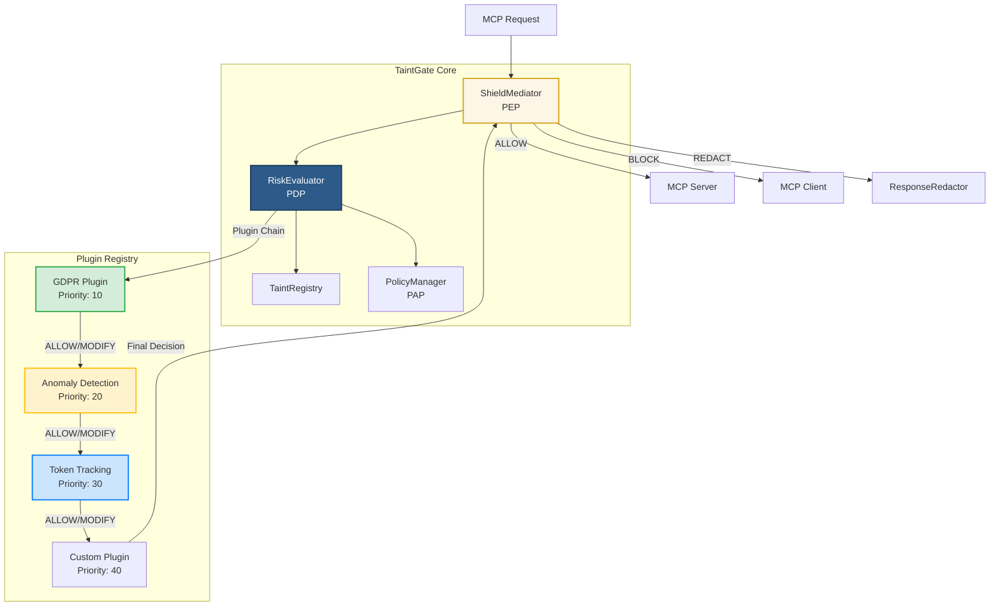
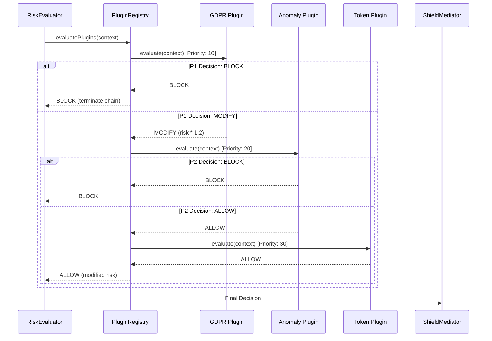

# TaintGate Plugin Architecture Design

## Overview

The plugin architecture enables extensible governance without modifying core TaintGate code. Plugins can intercept, evaluate, and modify security decisions in a chain-based execution model.

## Architecture Diagram



## Plugin Execution Flow



## Plugin Categories

### 1. Compliance Plugins

**Purpose**: Enforce regulatory requirements

**Examples**:
- GDPR Compliance Plugin
- HIPAA Compliance Plugin
- PCI-DSS Compliance Plugin
- SOC 2 Compliance Plugin

**Typical Priority**: 10-15 (high priority, evaluated early)

---

### 2. Database Governance Plugins

**Purpose**: Govern database access and operations

**Examples**:
- SQL Injection Detection Plugin
- Query Complexity Analysis Plugin
- Database Operation Control Plugin (READ/WRITE/DELETE)
- Table-Level Access Control Plugin
- Row-Level Security (RLS) Plugin
- Data Masking Plugin (for query results)
- Query Result Limiting Plugin

**Typical Priority**: 5-20 (very high to high priority)

**Key Features**:
- ✅ SQL injection detection and blocking
- ✅ Operation-level permissions (SELECT, INSERT, UPDATE, DELETE)
- ✅ Table-level access control
- ✅ Row-level security enforcement
- ✅ Query complexity limits (joins, subqueries, length)
- ✅ Result set size limiting
- ✅ Sensitive data masking in responses

**See**: `DATABASE_GOVERNANCE_PLUGINS.md` for detailed implementation

---

### 3. Threat Detection Plugins

**Purpose**: Detect security threats and anomalies

**Examples**:
- Anomaly Detection Plugin (ML-based)
- Data Exfiltration Detection Plugin
- Insider Threat Detection Plugin
- Zero-Day Attack Detection Plugin

**Typical Priority**: 20-25 (medium priority)

---

### 4. Cost Management Plugins

**Purpose**: Track and limit resource usage

**Examples**:
- Token Usage Tracking Plugin
- Quota Management Plugin
- Budget Alert Plugin
- Cost Optimization Plugin

**Typical Priority**: 30-35 (low priority, evaluated late)

---

### 5. Integration Plugins

**Purpose**: Connect with external systems

**Examples**:
- SIEM Integration Plugin (Splunk, Datadog)
- Identity Provider Plugin (OAuth2, OIDC)
- Monitoring Plugin (Prometheus, Grafana)
- Notification Plugin (Slack, PagerDuty)

**Typical Priority**: 40+ (lowest priority)

---

## Implementation Details

### Plugin Interface

```typescript
export interface IGovernancePlugin {
  readonly id: string;
  readonly version: string;
  readonly priority: number;
  
  evaluate(context: EvaluationContext): Promise<PluginDecision>;
  healthCheck(): Promise<boolean>;
}

export interface PluginDecision {
  action: 'ALLOW' | 'BLOCK' | 'MODIFY';
  riskModifier?: number; // 0.0 - 2.0 multiplier
  reason?: string;
  metadata?: Record<string, unknown>;
}
```

### Plugin Registry

```typescript
export class PluginRegistry {
  private plugins: Map<string, IGovernancePlugin> = new Map();
  
  register(plugin: IGovernancePlugin): void {
    this.plugins.set(plugin.id, plugin);
    this.sortPlugins();
  }
  
  async evaluatePlugins(context: EvaluationContext): Promise<PluginChainResult> {
    const sortedPlugins = Array.from(this.plugins.values())
      .sort((a, b) => a.priority - b.priority);
    
    let modifiedRisk = context.riskScore;
    const metadata: Record<string, unknown> = {};
    
    for (const plugin of sortedPlugins) {
      const decision = await plugin.evaluate(context);
      
      if (decision.action === 'BLOCK') {
        return { action: 'BLOCK', reason: decision.reason, metadata };
      }
      
      if (decision.action === 'MODIFY' && decision.riskModifier) {
        modifiedRisk = clampRiskScore(modifiedRisk * decision.riskModifier);
      }
      
      if (decision.metadata) {
        metadata[plugin.id] = decision.metadata;
      }
    }
    
    return { action: 'ALLOW', modifiedRisk, metadata };
  }
}
```

### Integration with RiskEvaluator

```typescript
// In RiskEvaluator.evaluatePolicy()
async evaluatePolicy(context: EvaluationContext): Promise<PolicyDecision> {
  // 1. Calculate base risk score
  const baseRisk = await this.calculateRisk(context);
  
  // 2. Run plugin chain
  const pluginResult = await this.pluginRegistry.evaluatePlugins({
    ...context,
    riskScore: baseRisk,
  });
  
  // 3. Use plugin-modified risk score
  const finalRisk = pluginResult.modifiedRisk ?? baseRisk;
  
  // 4. Determine action based on final risk
  const action = this.determineAction(finalRisk);
  
  return {
    action,
    riskScore: finalRisk,
    metadata: {
      ...context.metadata,
      plugins: pluginResult.metadata,
    },
  };
}
```

---

## Plugin Development Guide

### Step 1: Create Plugin Class

```typescript
// plugins/my-plugin.ts
import { IGovernancePlugin, EvaluationContext, PluginDecision } from '@taintgate/plugins';

export class MyPlugin implements IGovernancePlugin {
  readonly id = 'my-plugin';
  readonly version = '1.0.0';
  readonly priority = 25;
  
  async evaluate(context: EvaluationContext): Promise<PluginDecision> {
    // Your plugin logic here
    if (/* condition */) {
      return { action: 'BLOCK', reason: 'Blocked by my plugin' };
    }
    
    if (/* another condition */) {
      return { action: 'MODIFY', riskModifier: 1.5, reason: 'Risk escalated' };
    }
    
    return { action: 'ALLOW' };
  }
  
  async healthCheck(): Promise<boolean> {
    return true; // Check if plugin is healthy
  }
}
```

### Step 2: Register Plugin

```typescript
// main.ts
import { PluginRegistry } from '@taintgate/core';
import { MyPlugin } from './plugins/my-plugin';

const registry = new PluginRegistry();
registry.register(new MyPlugin());

// Pass registry to RiskEvaluator
const riskEvaluator = new RiskEvaluator({
  policyManager,
  taintRegistry,
  pluginRegistry: registry, // Add plugin registry
});
```

### Step 3: Test Plugin

```typescript
// plugins/my-plugin.test.ts
describe('MyPlugin', () => {
  it('should block high-risk requests', async () => {
    const plugin = new MyPlugin();
    const context = createTestContext({ riskScore: 0.9 });
    
    const decision = await plugin.evaluate(context);
    
    expect(decision.action).toBe('BLOCK');
  });
});
```

---

## Plugin Marketplace Structure

```
taintgate-plugins/
├── compliance/
│   ├── gdpr-plugin/
│   ├── hipaa-plugin/
│   └── pci-plugin/
├── threat-detection/
│   ├── anomaly-detection-plugin/
│   └── exfiltration-detection-plugin/
├── cost-management/
│   ├── token-tracking-plugin/
│   └── quota-management-plugin/
└── integration/
    ├── splunk-plugin/
    └── datadog-plugin/
```

---

## Best Practices

### 1. Plugin Priority Guidelines

- **10-15**: Compliance plugins (must evaluate early)
- **20-25**: Threat detection plugins
- **30-35**: Cost management plugins
- **40+**: Integration plugins (logging, metrics)

### 2. Plugin Decision Guidelines

- **BLOCK**: Use sparingly, only for critical violations
- **MODIFY**: Use to adjust risk scores based on context
- **ALLOW**: Default action, let other plugins evaluate

### 3. Performance Considerations

- Plugins should complete evaluation in < 10ms
- Use caching for expensive operations
- Implement timeout protection
- Fail gracefully (return ALLOW on error)

### 4. Error Handling

```typescript
async evaluate(context: EvaluationContext): Promise<PluginDecision> {
  try {
    // Plugin logic
  } catch (error) {
    // Log error but don't block request
    this.logger.error('Plugin evaluation failed', { error, pluginId: this.id });
    return { action: 'ALLOW' }; // Fail-open for non-critical plugins
  }
}
```

---

## Plugin Configuration

Plugins can be configured via policy files:

```json
{
  "plugins": {
    "gdpr-compliance": {
      "enabled": true,
      "config": {
        "retentionDays": 30,
        "requireConsent": true
      }
    },
    "anomaly-detection": {
      "enabled": true,
      "config": {
        "threshold": 0.8,
        "mlModel": "v1.2.3"
      }
    }
  }
}
```

---

## Future Enhancements

### 1. Plugin Hot-Reload

Allow plugins to be updated without restarting TaintGate:

```typescript
registry.reloadPlugin('my-plugin', newPluginInstance);
```

### 2. Plugin Dependencies

Support plugin dependencies:

```typescript
export class MyPlugin implements IGovernancePlugin {
  readonly dependencies = ['gdpr-compliance', 'anomaly-detection'];
  // ...
}
```

### 3. Plugin Metrics

Track plugin performance:

```typescript
interface PluginMetrics {
  evaluationCount: number;
  averageLatency: number;
  blockCount: number;
  modifyCount: number;
}
```

---

**Last Updated**: 2025-01-15  
**Status**: Design Complete - Ready for Implementation

